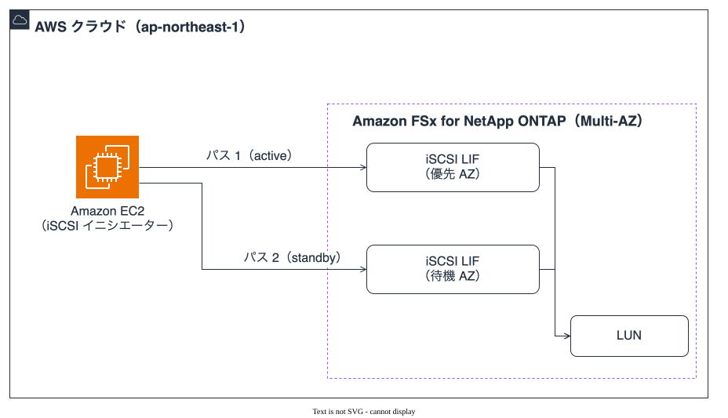
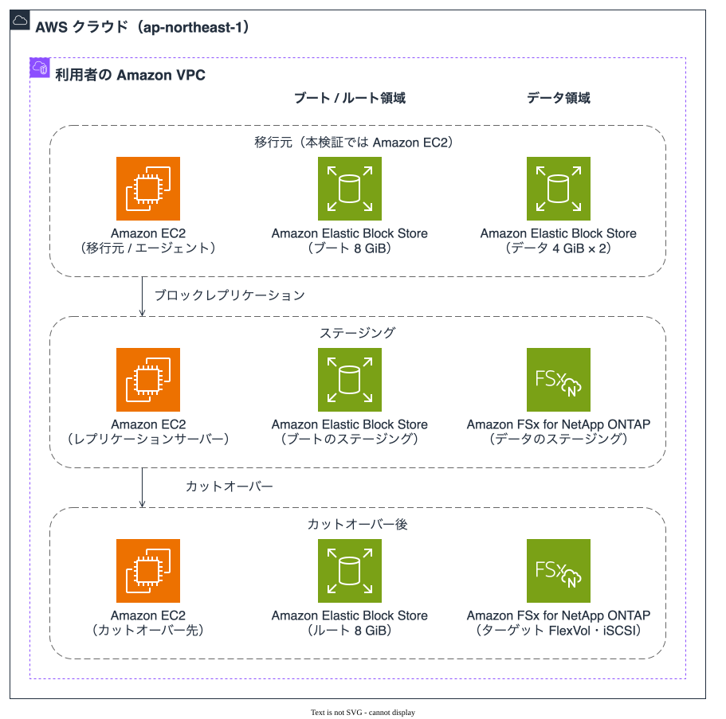
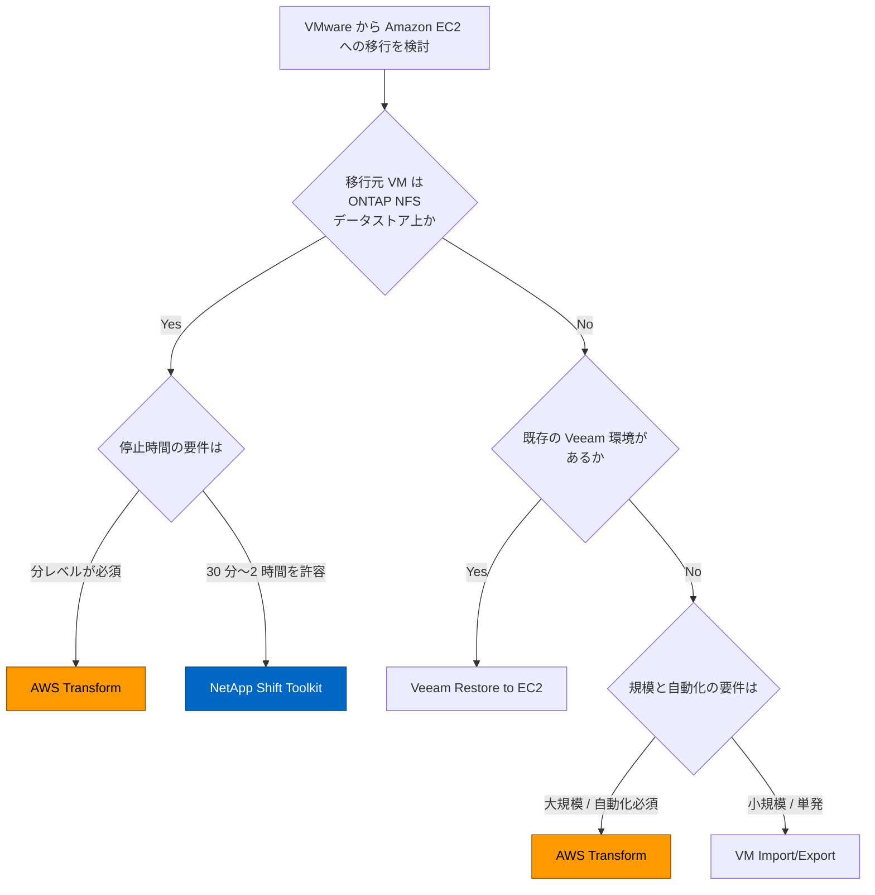

# アーキテクチャ図

このページは本プロジェクトの構成図とフローを 1 か所に集めたものです。

**最終更新**: 2026-07-17

---

## 2 系統の図と使い分け

図は 2 系統あり、描き方が違います。

| 系統 | 対象 | 描き方 | 置き場 |
|------|------|--------|--------|
| 構成図・段の図 | AWS サービスが登場するもの | draw.io + AWS 公式アーキテクチャアイコン（`tools/build_diagrams.py` が生成） | `docs/_assets/diagrams/*.drawio` → `docs/_assets/images/*.svg` |
| 判断の分岐 | 方式選定 | Mermaid（このページに直接） | このファイル |

**AWS サービスが出てくる図は、検証済みかどうかに関わらず公式アイコンと公式サービス名で描きます。** 読者がサービスを取り違える方が、未検証の段が構成図に見えることより害が大きいためです。検証範囲は図の中の枠のタイトルと本文で示します。

Mermaid で書くのは方式選定だけです。選ぶ対象がツールであって AWS サービスではないので、サービスアイコンが意味を持ちません。

構成図の生成・検査手順は [図の作り方](../agent/diagrams.md) にあります。英語版は同じディレクトリの `-en` 付きファイルです。

---

## 移行元から AWS までの全体構成

図 1: NetApp Shift Toolkit を使う場合の移行元と移行先。Amazon FSx for NetApp ONTAP（以降 FSx for ONTAP）側に状態が 2 つあることを分けて描いています。

**SnapMirror が運ぶのは VMDK で、LUN ではありません。** 複製先は NFS データストアの中身（VMDK ファイル）をそのまま持つボリュームです。iSCSI LUN になるのはその後で、[Shift Toolkit 移行手順書](../ja/shift-toolkit-ec2-procedure.md) の Phase 4 では break がステップ 5、VMDK → LUN 変換がステップ 9 です。つまり変換は FSx for ONTAP 側で break の後に起きます。

**この経路で FSx for ONTAP が NFS を提供する場面はありません。** NFS はソース側のデータストアだけで、AWS 側のデータアクセスは iSCSI のみです（同手順書の必要ポート表に 2049 はなく、3260 があります）。したがって「NFS 用と iSCSI 用を別に描く」ではなく「1 本のボリュームの前後の状態を分けて描く」形にしています。

**変換は FlexClone ベースでサイズにほぼ依存しません。** ただしこの値は NetApp の記述と手順書の見積り表によるもので、本プロジェクトの実測ではありません。実測したのはブートディスク側の 10 ステップ（50 GB で約 1 時間 49 分。うち S3 アップロード 68 分、AMI インポート 36 分）で、データディスクの LUN 変換は測定範囲外です。内訳は [移行方式比較](../ja/migration-method-comparison.md#4-ダウンタイム比較実測--推定) にあります。

**VM Import/Export の経路は図に描いていません。** ブートディスクは VMDK → RAW → Amazon S3 → AMI という別経路をたどりますが、中間の S3 と AMI を描くと図が 2 倍になります。手順は [VM Import/Export 手順書](../ja/vm-import-procedure.md) にあります。

---

## iSCSI マルチパスの経路

図 2: 1 つの LUN に 2 本のパス。**フェイルオーバーを実行するのはホスト側の multipath です。** ストレージ側の役割は複数のパスを見せるところまでで、どちらを使うかはイニシエーターが決めます。

パス優先度の値（優先側 50 / 待機側 10）と、パス本数を帯域から決める算術は [FSx for ONTAP iSCSI 設定ガイド](../ja/fsxn-iscsi-setup.md) にあります。図に入れていないのは、**画像が縮小されたときに最初に読めなくなるのが図中で最も文字数の多い部分**だからです。

---

## AWS Transform を使う場合の構成

AWS Transform 経由の移行は、データが流れる経路と、それを制御する経路が別物です。1 枚に描くと線が交差して両方読めなくなるため 2 枚に分けています。

図 3: データ経路。**行がインスタンス、列が領域**として読みます。どのインスタンスのどの領域が Amazon Elastic Block Store と FSx for ONTAP のどちらに載るかを示します。

図 4: 制御経路。AWS Transform / AWS MGN と利用者側リソースの間の呼び出し関係です。

図 5: Finalize での FlexClone。ステージングボリュームから複製を作って移行先に渡す段階です。

手順は [AWS Transform 移行手順書](../ja/aws-transform-migration-procedure.md)、コンソール操作は [コンソール手順](../ja/atx-fsxn-console-procedure.md) にあります。

---

## 移行ジャーニーの段

> **この節は検証結果ではありません。** Phase 1（リホスト）だけが本プロジェクトの検証範囲で、Phase 2 / Phase 3 と選択肢は整理です。図の中の枠のタイトルにも同じことを書いています。

図 6: リホストから先の段と、リホスト以外の選択肢。Phase 1 で FSx for ONTAP にデータを置くと、Phase 2 以降でも同じボリュームを NFS / iSCSI のどちらでも参照できます。

**段の中に線を引いているのは Phase 1 だけです。** Phase 2 の Amazon Elastic Container Service と Amazon Elastic Kubernetes Service は互いに代替であって流れではないので、矢印を引くと「ECS の次が EKS」と読めてしまいます。枠と並びが「この段の構成要素」を表しています。Phase 1 の Amazon EC2 → FSx for ONTAP だけは実測した経路なので引いています。

NC2（Nutanix）だけ箱で描いてあるのはサードパーティの製品だからです。公式アイコンは AWS のサービスにだけ使います。

---

## 方式選定の分岐

分岐の根拠、各方式の制約、実測ダウンタイムは [移行方式比較](../ja/migration-method-comparison.md) にあります。**そちらが判断の基準で、この図はその要約です。**

図 7: 4 方式の分岐。AWS Transform は移行元を問わないため 2 か所に現れます。**葉には方式名しか入れていません。** 成熟度（AWS Transform の FSx for ONTAP 宛先は Public Preview、Shift Toolkit は Early Preview）と各方式の制約は比較表にあり、図に入れると横幅が 2 倍になって縮小時に読めなくなります。

どの方式も排他ではなく、VM 特性ごとに使い分ける前提です（[組み合わせパターン](../ja/migration-method-comparison.md#6-組み合わせパターン)）。

---

## 関連ドキュメント

- [移行方式比較](../ja/migration-method-comparison.md)
- [Shift Toolkit EC2 移行手順書](../ja/shift-toolkit-ec2-procedure.md)
- [AWS Transform 移行手順書](../ja/aws-transform-migration-procedure.md)
- [FSx for ONTAP iSCSI 設定ガイド](../ja/fsxn-iscsi-setup.md)
- [図の作り方](../agent/diagrams.md)
