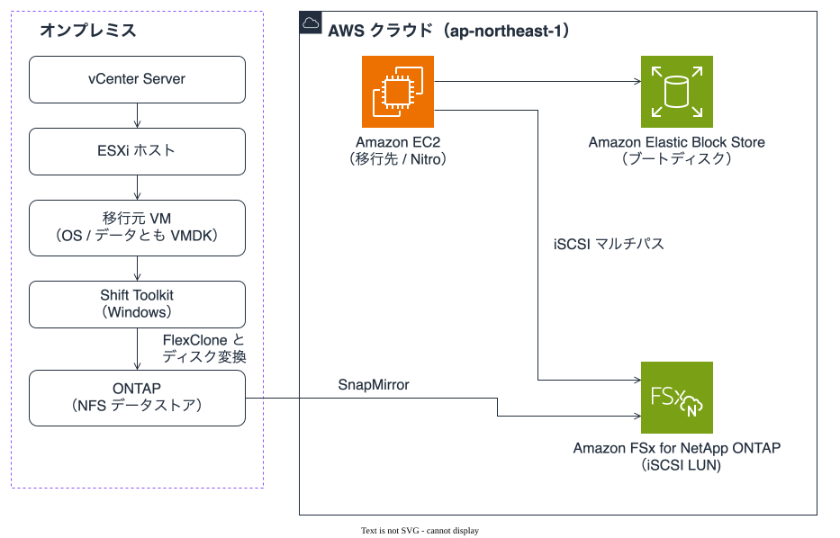
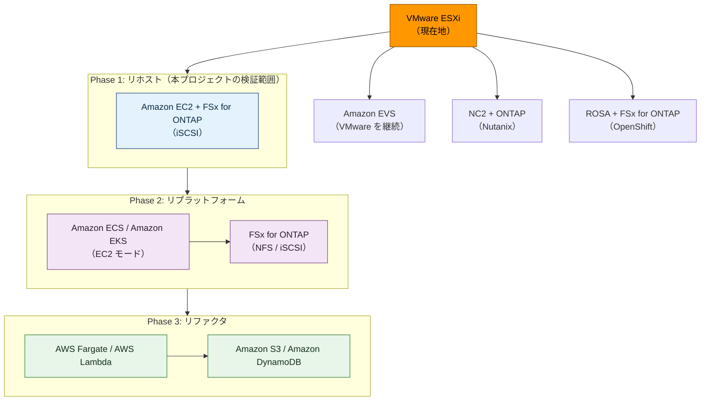
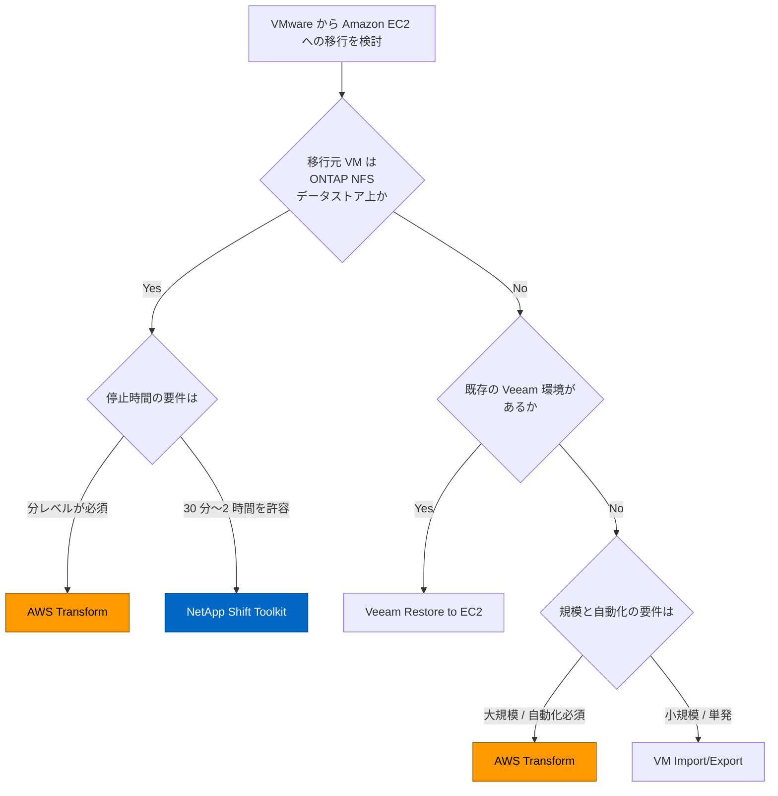

# アーキテクチャ図

このページは本プロジェクトの構成図とフローを 1 か所に集めたものです。

**最終更新**: 2026-07-17

---

## 2 系統の図と使い分け

図は 2 系統あり、描き方が違います。

| 系統 | 対象 | 描き方 | 置き場 |
|------|------|--------|--------|
| 構成図 | 実在するリソースと経路 | draw.io + AWS 公式アーキテクチャアイコン（`tools/build_diagrams.py` が生成） | `docs/_assets/diagrams/*.drawio` → `docs/_assets/images/*.svg` |
| 判断の分岐 | 移行ジャーニー、方式選定 | Mermaid（このページに直接） | このファイル |

分けている理由は 2 つあります。**未検証の将来フェーズに公式アイコンを付けると、推測が構成図に見えます。** 移行ジャーニーの Phase 2 / Phase 3 は本プロジェクトで検証しておらず、意思決定の見取り図であって構成ではありません。もう 1 つは、方式選定の分岐が選ぶ対象がツールであって AWS サービスではないため、サービスアイコンが意味を持たないことです。

構成図の生成・検査手順は [図の作り方](../agent/diagrams.md) にあります。英語版は同じディレクトリの `-en` 付きファイルです。

---

## 移行元から AWS までの全体構成

図 1: NetApp Shift Toolkit を使う場合の移行元と移行先。Amazon FSx for NetApp ONTAP（以降 FSx for ONTAP）はデータディスクを iSCSI LUN として受け、ブートディスクは Amazon Elastic Block Store に載ります。

**VM Import/Export の経路は図に描いていません。** ブートディスクだけを Amazon Elastic Block Store へ運ぶ別経路で、移行元 VM から見ると Amazon Elastic Block Store が右上にあり、線を引くと上向きになります。手順は [VM Import/Export 手順書](../ja/vm-import-procedure.md) にあります。

---

## iSCSI マルチパスの経路

図 2: 1 つの LUN に 2 本のパス。**フェイルオーバーを実行するのはホスト側の multipath です。** ストレージ側の役割は複数のパスを見せるところまでで、どちらを使うかはイニシエーターが決めます。

パス優先度の値（優先側 50 / 待機側 10）と、パス本数を帯域から決める算術は [FSx for ONTAP iSCSI 設定ガイド](../ja/fsxn-iscsi-setup.md) にあります。図に入れていないのは、**画像が縮小されたときに最初に読めなくなるのが図中で最も文字数の多い部分**だからです。

---

## AWS Transform を使う場合の構成

AWS Transform 経由の移行は、データが流れる経路と、それを制御する経路が別物です。1 枚に描くと線が交差して両方読めなくなるため 2 枚に分けています。

図 3: データ経路。**行がインスタンス、列が領域**として読みます。どのインスタンスのどの領域が Amazon Elastic Block Store と FSx for ONTAP のどちらに載るかを示します。

図 4: 制御経路。AWS Transform / AWS MGN と利用者側リソースの間の呼び出し関係です。

図 5: Finalize での FlexClone。ステージングボリュームから複製を作って移行先に渡す段階です。

手順は [AWS Transform 移行手順書](../ja/aws-transform-migration-procedure.md)、コンソール操作は [コンソール手順](../ja/atx-fsxn-console-procedure.md) にあります。

---

## 移行ジャーニーの見取り図

> **この節は検証結果ではありません。** Phase 1（リホスト）だけが本プロジェクトの検証範囲で、Phase 2 / Phase 3 と代替案は選択肢の整理です。

図 6: リホストから先の選択肢。Phase 1 で FSx for ONTAP にデータを置くと、Phase 2 以降でも同じボリュームを NFS / iSCSI のどちらでも参照できます。

---

## 方式選定の分岐

分岐の根拠、各方式の制約、実測ダウンタイムは [移行方式比較](../ja/migration-method-comparison.md) にあります。**そちらが判断の基準で、この図はその要約です。**

図 7: 4 方式の分岐。AWS Transform は移行元を問わないため 2 か所に現れます。**葉には方式名しか入れていません。** 成熟度（AWS Transform の FSx for ONTAP 宛先は Public Preview、Shift Toolkit は Early Preview）と各方式の制約は比較表にあり、図に入れると横幅が 2 倍になって縮小時に読めなくなります。

どの方式も排他ではなく、VM 特性ごとに使い分ける前提です（[組み合わせパターン](../ja/migration-method-comparison.md#6-組み合わせパターン)）。

---

## 関連ドキュメント

- [移行方式比較](../ja/migration-method-comparison.md)
- [Shift Toolkit EC2 移行手順書](../ja/shift-toolkit-ec2-procedure.md)
- [AWS Transform 移行手順書](../ja/aws-transform-migration-procedure.md)
- [FSx for ONTAP iSCSI 設定ガイド](../ja/fsxn-iscsi-setup.md)
- [図の作り方](../agent/diagrams.md)
